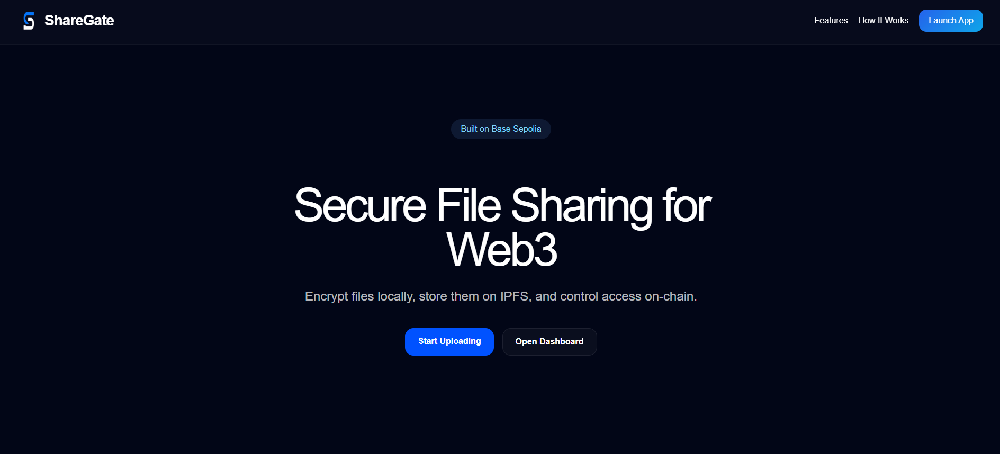
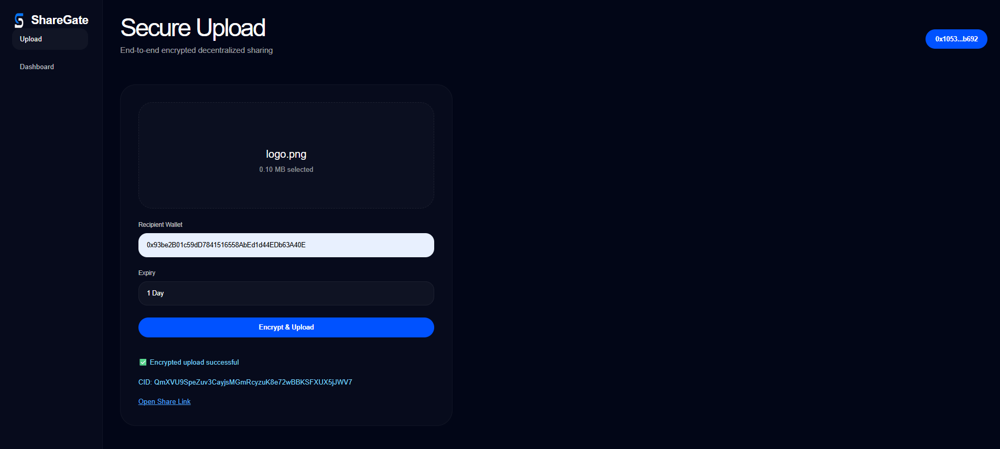
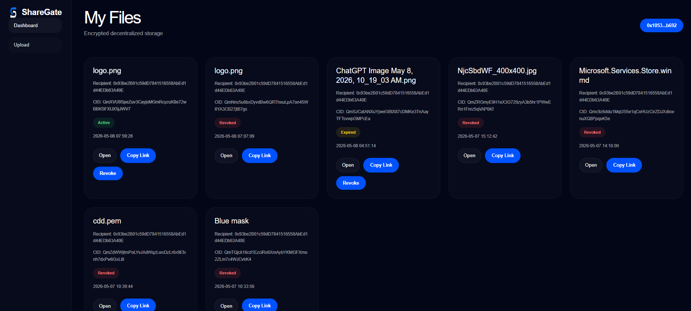

# ShareGate

Encrypted decentralized file sharing built on Base.

---

## Overview

ShareGate is a secure file sharing platform that combines:

* End-to-end encryption
* IPFS decentralized storage
* Wallet-based access control
* Onchain permission management

Files are encrypted locally before upload, stored on IPFS, and shared through smart contract-controlled access.

---

## Features

* AES encrypted file uploads
* IPFS storage using Pinata
* Wallet-gated access
* Share links
* Access revocation
* Expiry-based access control
* Base Sepolia integration
* Dashboard for file management

---

## Screenshots

### Landing Page



---

### Upload Flow



---

### Dashboard



---

## Tech Stack

### Smart Contracts

* Solidity
* Hardhat
* Ethers.js

### Backend

* Node.js
* Express
* SQLite
* Pinata SDK

### Frontend

* HTML
* CSS
* JavaScript

### Blockchain

* Base Sepolia

---

## How It Works

1. User selects a file
2. File is encrypted locally
3. Encrypted file uploads to IPFS
4. Share permissions stored onchain
5. Recipient decrypts file with wallet authorization

---

## Local Setup

### Clone repository

```bash
git clone https://github.com/TheFarLax/sharegate.git
cd sharegate
```

### Install dependencies

```bash
npm install
cd backend && npm install
```

### Configure environment variables

Create:

```bash
backend/.env
```

Add:

```env
PINATA_JWT=YOUR_PINATA_JWT
BASE_RPC_URL=https://sepolia.base.org
SHAREGATE_CONTRACT_ADDRESS=YOUR_CONTRACT_ADDRESS
```

### Start backend

```bash
cd backend
node server.js
```

### Start frontend

```bash
cd frontend
python3 -m http.server 8080
```

Open:

```text
http://localhost:8080/landing.html
```

---

## Smart Contract

Deployed on Base Sepolia.

Supports:

* createShare
* grantAccess
* revokeAccess
* expiry validation

---

## Future Improvements

* File previews
* Multi-recipient sharing
* Streaming downloads
* Mainnet deployment
* WalletConnect support
* Usage analytics

---

## License

MIT
